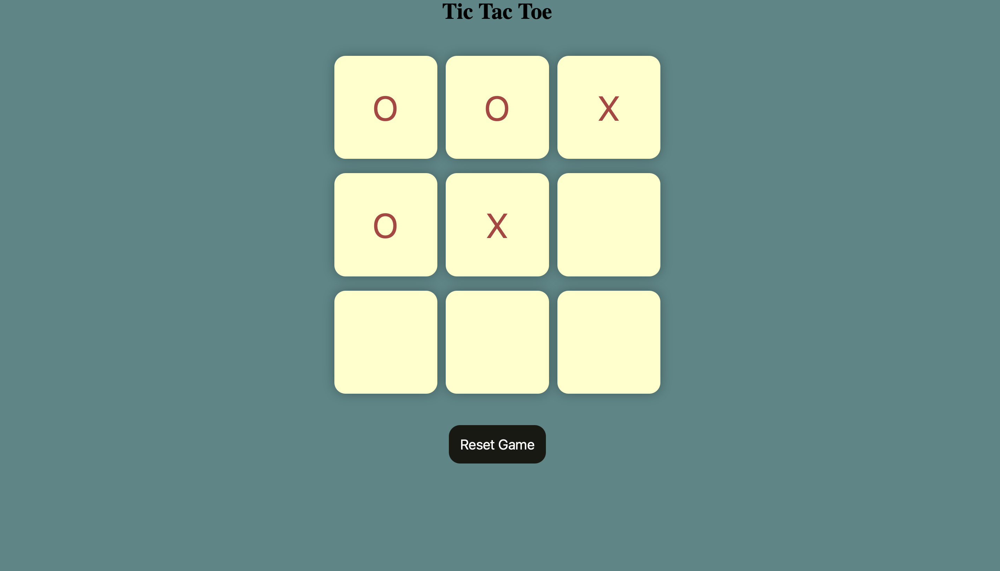
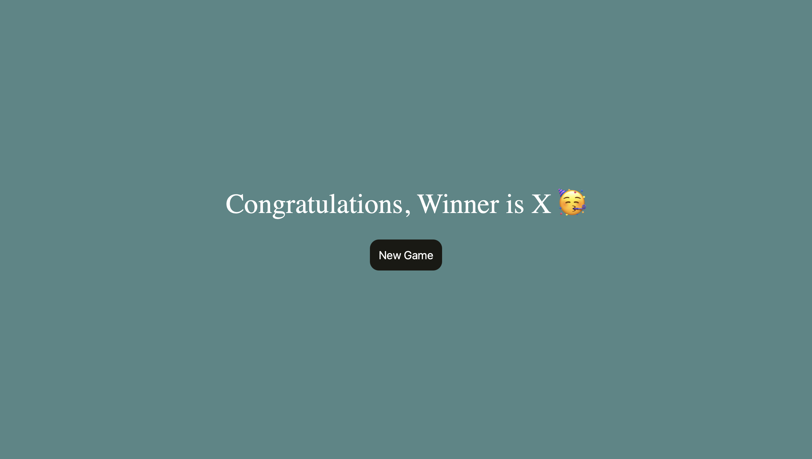
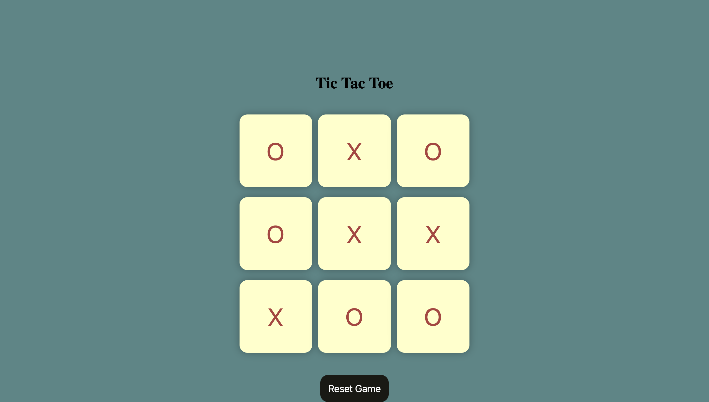
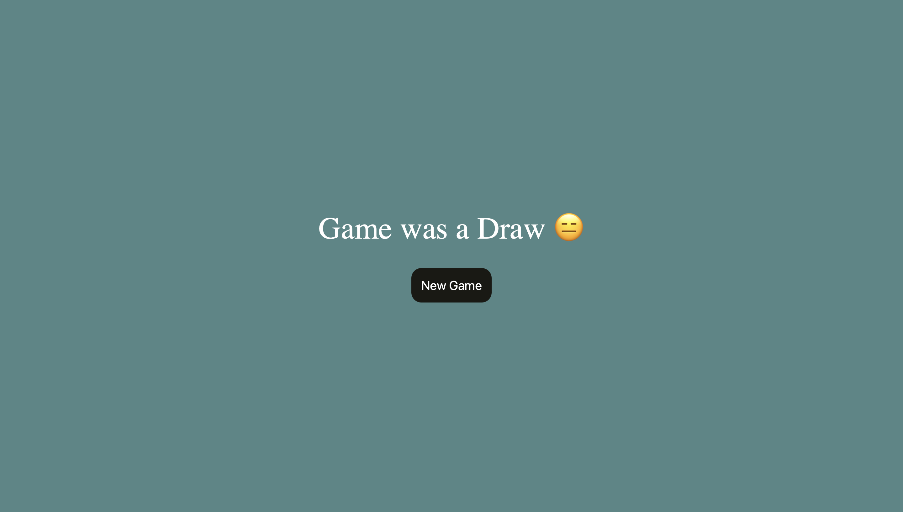

# 🎮 Tic-Tac-Toe Game

A fun and interactive web-based **Tic-Tac-Toe** game built with **HTML**, **CSS**, and **JavaScript**. Play as Player O or Player X and enjoy a smooth UI, instant win/draw detection, and reset functionality.

---

## 🌟 Features

- ✅ Two-player game: O vs X
- 🧠 Automatic win and draw detection
- 🔁 "New Game" and "Reset" buttons
- 🧼 Clean and responsive design
- 🔒 Disables already clicked boxes

---

## 🚀 Live Demo

👉 [Play the Game Here](https://ankitkr20.github.io/TicTacToe/)  
<!-- Replace with your GitHub Pages link after hosting -->

---

## 📁 Project Structure
tic-tac-toe/
├── index.html # Main HTML structure
├── style.css # Styling for the game
├── script.js # Game logic using JavaScript
└── README.md # Project documentation

---

## 📸 Screenshot

<!-- Upload a screenshot image in your repo and rename accordingly -->

---

## 🛠️ Tech Stack

- HTML5
- CSS3
- JavaScript (Vanilla)

---

## 🧠 How to Play

1. Player O starts first.
2. Click on an empty box to make your move.
3. The game alternates turns between O and X.
4. The first player to align three symbols in a row, column, or diagonal wins.
5. If all boxes are filled without a winner, it’s a draw!

---
